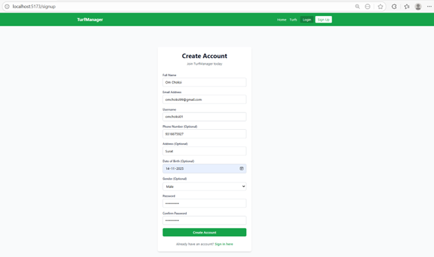
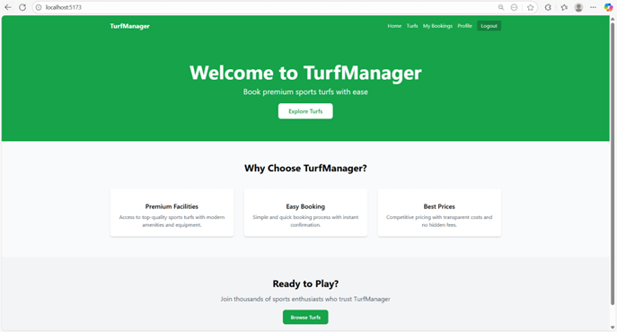
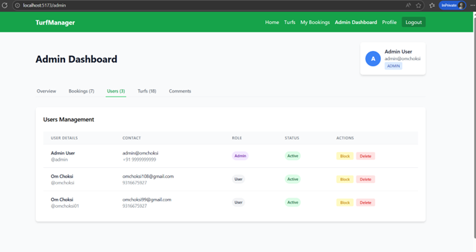
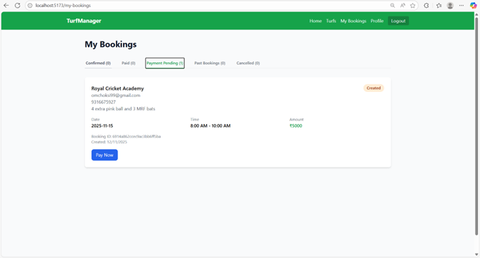
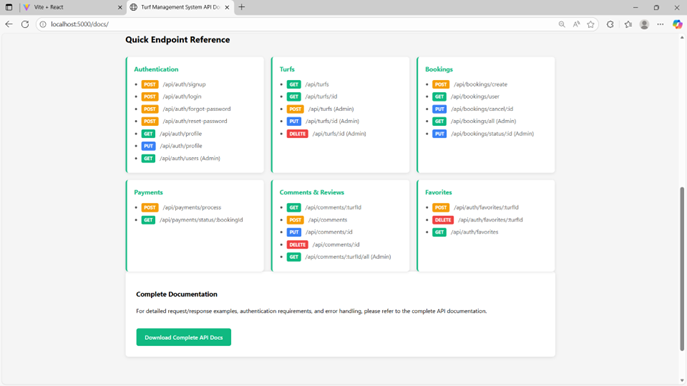

# Turf Management System

## Overview

The Turf Management System is a comprehensive web application designed to streamline sports turf booking and management operations. This full-stack solution provides an intuitive platform for users to discover, book, and manage sports facilities while offering administrators powerful tools to oversee operations, manage resources, and track business metrics.

Built with modern web technologies, the system ensures a seamless experience across devices with responsive design and real-time functionality. The application addresses the growing need for efficient sports facility management in urban areas, providing both user convenience and operational efficiency.

## Architecture

The system follows a client-server architecture with a React-based frontend and Node.js/Express backend, connected through RESTful APIs. Data persistence is handled by MongoDB, ensuring scalability and reliability. The application implements JWT-based authentication, secure payment processing, and comprehensive user role management.

## File Structure

```
Turf_Management_System/
├── assets/                    # Project assets and images
│   ├── 01.png                # Screenshot 1
│   ├── 02.png                # Screenshot 2
│   ├── 03.png                # Screenshot 3
│   ├── 04.png                # Screenshot 4
│   └── 05.png                # Screenshot 5
├── backend/                   # Server-side application
│   ├── config/               # Database and configuration files
│   ├── controllers/          # Business logic controllers
│   │   ├── authController.js # Authentication handling
│   │   ├── bookingController.js # Booking management
│   │   └── turfController.js # Turf operations
│   ├── middleware/           # Custom middleware
│   │   ├── authMiddleware.js # JWT authentication
│   │   └── uploadMiddleware.js # File upload handling
│   ├── models/               # Database models
│   │   ├── Booking.js        # Booking schema
│   │   ├── Turf.js          # Turf schema
│   │   └── User.js          # User schema
│   ├── routes/               # API route definitions
│   │   ├── authRoutes.js     # Authentication routes
│   │   ├── bookingRoutes.js  # Booking routes
│   │   └── turfRoutes.js     # Turf routes
│   ├── utils/                # Utility functions
│   │   └── email.js          # Email service
│   ├── uploads/              # File upload directory
│   ├── app.js                # Main application file
│   ├── createAdmin.js        # Admin user creation script
│   ├── createTurfs.js        # Turf data seeding script
│   └── package.json          # Backend dependencies
├── frontend/                  # Client-side application
│   ├── public/               # Static assets
│   ├── src/                  # Source code
│   │   ├── components/       # Reusable UI components
│   │   │   ├── Card.jsx      # Card wrapper component
│   │   │   ├── ErrorBoundary.jsx # Error handling
│   │   │   ├── Form.jsx      # Form components
│   │   │   └── Navbar.jsx    # Navigation component
│   │   ├── pages/            # Page components
│   │   │   ├── AdminDashboard.jsx # Admin management panel
│   │   │   ├── Home.jsx      # Landing page
│   │   │   ├── Login.jsx     # User authentication
│   │   │   ├── MyBookings.jsx # User booking history
│   │   │   ├── Profile.jsx   # User profile management
│   │   │   ├── ResetPassword.jsx # Password reset
│   │   │   ├── Signup.jsx    # User registration
│   │   │   ├── TurfDetails.jsx # Individual turf details
│   │   │   └── TurfsList.jsx # Turf listing page
│   │   ├── utils/            # Utility functions
│   │   │   └── auth.js       # Authentication utilities
│   │   ├── App.css           # Global styles
│   │   ├── App.jsx           # Main application component
│   │   ├── config.js         # API configuration
│   │   ├── index.css         # Base styles
│   │   └── main.jsx          # Application entry point
│   ├── eslint.config.js      # ESLint configuration
│   ├── index.html            # HTML template
│   ├── package.json          # Frontend dependencies
│   ├── postcss.config.js     # PostCSS configuration
│   ├── tailwind.config.js    # TailwindCSS configuration
│   └── vite.config.js        # Vite build configuration
├── docs/                     # Documentation
│   └── api-endpoints.txt     # API documentation
└── README.md                 # Project documentation
```

## Features

### User Features
- **User Registration and Authentication**: Secure signup and login with JWT tokens
- **Turf Discovery**: Browse and search sports facilities by location, sport type, and amenities
- **Detailed Turf Information**: Comprehensive facility details including pricing, facilities, and reviews
- **Flexible Booking System**: Support for both predefined time slots and custom time ranges
- **Payment Processing**: Secure payment handling with multiple payment methods (Credit Card, Debit Card, UPI)
- **Booking Management**: View booking history, manage upcoming bookings, and track payment status
- **Favorites System**: Save favorite turfs for quick access and future bookings
- **User Profile**: Manage personal information and booking preferences
- **Review and Rating System**: Leave reviews and ratings for booked facilities
- **Email Notifications**: Automated email receipts and booking confirmations

### Admin Features
- **Dashboard Analytics**: Comprehensive overview with key metrics and statistics
- **Turf Management**: Add, edit, delete, and manage sports facilities
- **Booking Oversight**: Monitor all bookings, approve/reject requests, and manage conflicts
- **User Management**: View user accounts, manage permissions, and handle support requests
- **Revenue Tracking**: Real-time revenue analytics and financial reporting
- **Facility Utilization**: Monitor turf usage patterns and optimize scheduling
- **Content Management**: Manage facility images, descriptions, and amenities
- **System Administration**: User role management and system configuration

### Technical Features
- **Responsive Design**: Mobile-first approach with cross-device compatibility
- **Real-time Updates**: Live booking status and availability updates
- **Secure Authentication**: JWT-based authentication with password hashing
- **File Upload**: Image upload functionality for turf photos and user avatars
- **Email Integration**: Automated email service for notifications and receipts
- **PDF Generation**: Booking receipts and invoices generation
- **Data Validation**: Comprehensive input validation and error handling
- **Performance Optimization**: Efficient database queries and caching strategies

## Technology Stack

### Frontend
- **React 19.1.1**: Modern JavaScript library for building user interfaces
- **React Router DOM 6.20.1**: Declarative routing for React applications
- **TailwindCSS 3.3.6**: Utility-first CSS framework for rapid UI development
- **Axios 1.12.2**: HTTP client for API communication
- **React Icons 5.5.0**: Popular icon library for React applications
- **Vite 7.1.2**: Fast build tool and development server

### Backend
- **Node.js**: JavaScript runtime for server-side development
- **Express.js 5.1.0**: Web application framework for Node.js
- **MongoDB**: NoSQL database for data storage
- **Mongoose 8.18.2**: MongoDB object modeling for Node.js
- **JWT 9.0.2**: JSON Web Tokens for authentication
- **bcryptjs 2.4.3**: Password hashing library
- **Multer 2.0.2**: Middleware for handling file uploads
- **Nodemailer 7.0.6**: Email sending functionality
- **PDFKit 0.17.2**: PDF generation library

### Development Tools
- **ESLint**: Code linting and formatting
- **PostCSS**: CSS processing tool
- **Autoprefixer**: CSS vendor prefixing
- **Nodemon**: Automatic server restart during development

## Getting Started

### Prerequisites
- Node.js (version 16 or higher)
- MongoDB (local installation or cloud service like MongoDB Atlas)
- npm or yarn package manager

### Installation

1. **Clone the repository**
   ```bash
   git clone https://github.com/satanismit/Turf_Management_System.git
   cd Turf_Management_System
   ```

2. **Backend Setup**
   ```bash
   cd backend
   npm install
   # Create .env file with required environment variables
   npm run dev
   ```

3. **Frontend Setup**
   ```bash
   cd ../frontend
   npm install
   npm run dev
   ```

4. **Access the Application**
   - Frontend: http://localhost:5173
   - Backend API: http://localhost:3000

### Environment Variables

Create a `.env` file in the backend directory with the following variables:
```
PORT=3000
MONGODB_URI=mongodb://localhost:27017/turf_management
JWT_SECRET=your_jwt_secret_key
EMAIL_USER=your_email@gmail.com
EMAIL_PASS=your_email_password
```

## API Documentation

The API endpoints are documented in `docs/api-endpoints.txt`. The system provides RESTful APIs for:
- User authentication and management
- Turf operations (CRUD)
- Booking management
- Payment processing
- File uploads
- Review and rating system

## Screenshots







## Team

**Smit Satani (LEADER)**  
Project Lead and Full-Stack Developer  
Responsible for overall architecture, backend development, and project coordination.

**Om Choksi**  
Frontend Developer  
Specialized in React development, UI/UX design, and user interface implementation.

**Krish Vaghani**  
Backend Developer  
Focused on server-side logic, database design, and API development.
